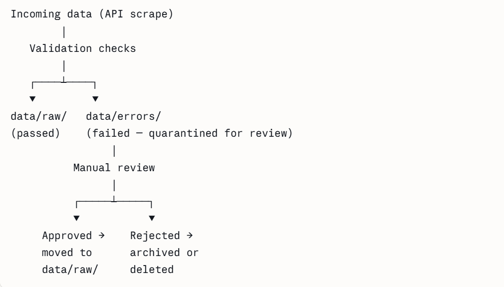
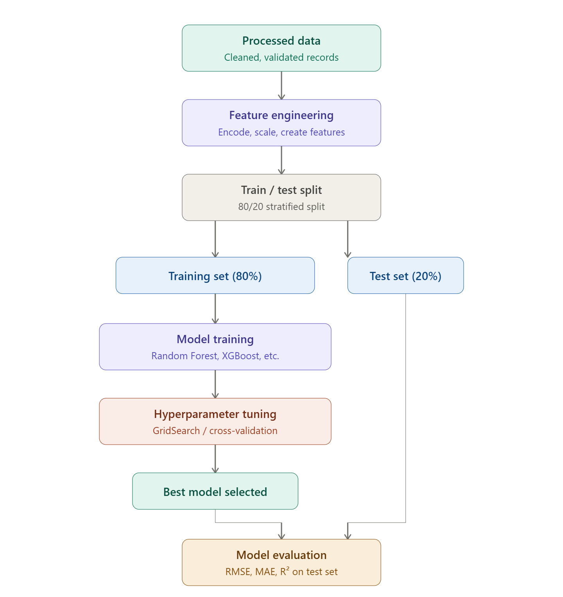

# ML-Powered Housing Price Prediction System

**BANA 7075 — Final Project Proposal**

**Group Members:** Ryan O'Connor, Robin Cohen, BJ Osibogun, Samuel Gunther

---

## 1. Domain Problem & Stakeholders

### Domain Problem

There is a high level of price volatility in the real estate market, which makes it hard to accurately estimate property values. Our final project aims to help solve this challenge by delivering ML-powered, data-driven valuations for properties.

### Stakeholders

**Primary Stakeholders:**

- Home buyers and sellers who require accurate price estimates to make significant personal financial decisions
- Banks and mortgage lenders that rely on property values to determine how much money to lend for homes

**Secondary Stakeholders:**

- Local government agencies that use property value to analyze housing affordability

---

## 2. Justification for ML Approach

### Why Machine Learning

This problem requires machine learning since we will need to discover complex, non-linear patterns across large datasets, such as the impact of school district on property value. Additionally, an ML model would be able to dynamically adapt to market fluctuations. We also have a significant volume of high-quality data for training and testing the model, which is required for ML. Finally, machine learning is suited for this problem since the system will need to make accurate predictions on new, unseen data as property listings arrive over time.

### Proposed ML Model

We propose using a Random Forest model, which will construct multiple decision trees to predict property values. By averaging the results of these individual trees, the model will provide a more accurate estimate than a single decision tree.

### Justification of Model Choice

Random Forest is highly resistant to overfitting, which ensures that our model is not too distracted by outlier sales in an incredibly volatile real estate market. Additionally, Random Forest can efficiently process diverse numerical and categorical data found in real estate listings. Finally, Random Forest is more computationally efficient than other more complex alternatives.

---

## 3. Value Proposition

### Tangible Benefits

- The ML system reducing pricing errors caused by market volatility by using data-driven predictions will help homebuyers avoid overpaying and enable sellers to list at competitive prices, leading to higher return on investments.
- By reducing reliance on manual appraisals and other assessments, financial institutions, local government agencies, homebuyers and sellers can cut down operational and administrative costs.
- Accurate property valuations allow banks and mortgage lenders to better assess collateral value before issuing loans. This lowers the risk of over-lending and foreclosures.

### Intangible Benefits

- **Market Transparency** — The model will make pricing insights more accessible and understandable to all stakeholders, which will reduce miscommunications and allow buyers, sellers, and regulators to make more informed decisions.
- **Policy Support** — Local governments can use data from the model to better understand housing affordability trends, which will allow them to make better informed decisions in setting up policies.
- **Consumer Confidence** — Consistent, data-backed price estimates will help users feel more confident in their decisions, which will improve trust in the overall real estate process. It can also increase market participation in volatile markets.

### Overall Impact

A housing price prediction system will help solve the problem of price volatility by giving more consistent and data-based property estimates. Instead of relying only on human judgment, the system uses large and most recent data to spot patterns in the market, which leads to more reliable pricing even when conditions change quickly. It will help homebuyers avoid overpaying, sellers set fair prices, and banks make safer lending decisions. Homes are more likely to be priced correctly, which can speed up sales and reduce delays. Overall, the system makes the housing market more stable, easier to understand, and more efficient for everyone involved.

---

## 4. Performance Metrics

### Technical Metrics

- **Latency** — Measures how quickly the system returns predictions. This is important because it's a user-facing app.
- **Uptime / Availability** — The system is expected to be consistently accessible and functioning without failures.
- **Root Mean Squared Error (RMSE)** — Gives more weight to large errors, which is important for avoiding big pricing mistakes that can impact financial decisions.
- **Mean Absolute Error (MAE)** — Will help show how far off predictions are on average by measuring the average difference between predicted and actual housing prices.

### Business Metrics

- **Sold Price Accuracy Rate** — Measures how often predicted prices are close to final sale prices, showing how useful the system is for buyers and sellers.
- **Average Time on Market** — Tracks how long properties take to sell, where better pricing should help reduce delays.
- **Loan Default Rate** — Tracks whether improved valuations help lenders reduce risky loans and defaults.
- **Revenue Impact** — Will measure increases in sales efficiency or transaction volume from better pricing decisions.

---

## 5. Data Source & DataOps Concepts

### Dataset

We will be using the Python package [HomeHarvest](https://github.com/Bunsly/HomeHarvest) to gather training data. This package allows for location-specific data for houses sold in a user-defined area by scraping data from Realtor.com. Utilizing an API like this as opposed to a static dataset allows for a more flexible project — we can tailor our model to predict housing prices in whatever location is most valuable to stakeholders.

### Data Ingestion

Data will be ingested using the `scrape_property` function. We can utilize this function to create our training dataset(s).

### Data Validation

Data ingested into the pipeline will be validated based on completeness, accuracy, and schema. All data validation will be handled through the great_expectations python packagse. Systems will be built into the data pipeline to handle the following:

**Completeness:**

- Missing values will be recorded for each column
- Quantity of missing values for each column will determine the solution:
  - Columns where the majority of data is missing will be excluded altogether
  - Columns with minor levels of incompletes will call for an imputation strategy

**Accuracy:**

- Fields should contain appropriate values based on context. Examples:
  - Year built should not be in the future or before a reasonable cutoff like 1900
  - Stories will likely be between 1–3; very few houses would be more than 4 or 5 stories

**Schema Validations:**

- Each column should contain values in the format assigned to the column:
  - Zip code will always be 5 digits, state will be a 2-character code, bedrooms will be an integer value, etc.

### Data Versioning

Mlflow will be used for data versioning. Data will be tracked from the scraping phase all the way to the point at which it enters the model. The mlflow ui will record exactly what is done to the data through the different steps, for example during data validation mlflow will report the number of validations passed and failed and what the data failed on.

### Data Pipeline Architecture

1. **Raw data is ingested** via `scrape_property` function
   - Metadata recorded in mlflow
2. **Data validation** procedures are performed on raw data via great_expectations when raw data is called into the validation script
   - Data that fails validation checks is moved to an error location for manual review
   - Data that fails manual review is archived or deleted
   - Data that passes review can reenter the pipeline
   - Mlflow tracks pass and fail details along with manual review decisions

3. **Processed data** starts from validated and cleaned raw data
   - Processed data is used to perform feature engineering and model training

---

## 6. Design Principles

### Principle 1: Adaptability and Flexibility

Our model should be robust to stakeholder needs. For example, if one stakeholder wants to use the model for housing in California, but another is concerned with Midwestern pricing, then our pipeline can satisfy both. Raw data from any location can be pulled, ingested into the model development pipeline, and then used for training a model specific to the stakeholder's geographical needs. This is the primary motivation behind building a pipeline via an API tool rather than a static dataset.

### Principle 2: Automation

Although data validation may require manual review, we would like the majority of the model building pipeline to be automatic. Data is ingested based on stakeholder preferences, validated, used to train, and predict pricing. Model tuning will be automated — hyperparameters can be tuned to the new data being fed into our system without the need for code adjustments. Finally, users will be able to manipulate a UI to make housing price predictions. Model information for these predictions will be automatically fed into the UI tool.

### Principle 3: Modularity and Abstraction

Aligning with our other design principles, each stage of the model development pipeline will be modular. For example, making a change to the data ingestion portion of the pipeline will not break the model training portion and vice versa. Each portion of the pipeline is self-contained and automated.

---

## 7. Development Plan & Timeline

### Phase 1: Problem Definition

In this phase, our group focused on defining the problem and figuring out the overall direction of the project. We decided on using a housing price prediction system and will be selecting a dataset that includes important features such as location, size, and number of rooms. We are also planning to use a machine learning model like Random Forest, but this may be adjusted as we explore the data further. Overall, this phase is about getting aligned as a group and making sure we have a clear plan before moving into development.

### Phase 2: Prototype Development

In this phase, we plan to start building the actual system. We will begin by loading and cleaning the dataset, handling missing values, and preparing the data for modeling. After that, we will train an initial version of the model and evaluate how well it performs. We also plan to create a simple interface where a user can input housing features and receive a predicted price. The goal here is to create a basic working version of the system, even if it still needs improvement.

### Phase 3: Refinement & Delivery

In the final phase, we will focus on improving the system based on what we learned earlier. This includes tuning the model to improve accuracy and making the interface more user-friendly. We will also make sure all parts of the system work well together. In addition, we will complete the final report, prepare our presentation, and record a demo showing how the system works from start to finish.

### Project Timeline

| Week   | Phase          | Key Tasks                                              | Deliverables              |
|--------|----------------|--------------------------------------------------------|---------------------------|
| Week 1 | Proposal       | Define problem, identify dataset, confirm model approach | Project Proposal          |
| Week 2 | Data & Setup   | Load data, clean dataset, explore features             | Clean Dataset             |
| Week 3 | Prototype      | Train model, evaluate results, build interface         | Working Prototype + Demo  |
| Week 4 | Improvements   | Tune model, improve accuracy, refine interface         | Improved System           |
| Week 5 | Final          | Final testing, complete report, prepare presentation   | Final Report + Demo       |

### Risks & Challenges

- The dataset may have missing or inconsistent data that could affect results
- The model may not perform as well as expected at first
- Time constraints could make it difficult to fully refine the system
- Combining all parts of the project into one working system may be challenging

### Mitigation Strategies

- Spend time early on cleaning and understanding the dataset
- Start simple and improve the model step by step
- Divide work clearly among group members to stay on track
- Test each part separately before putting everything together
